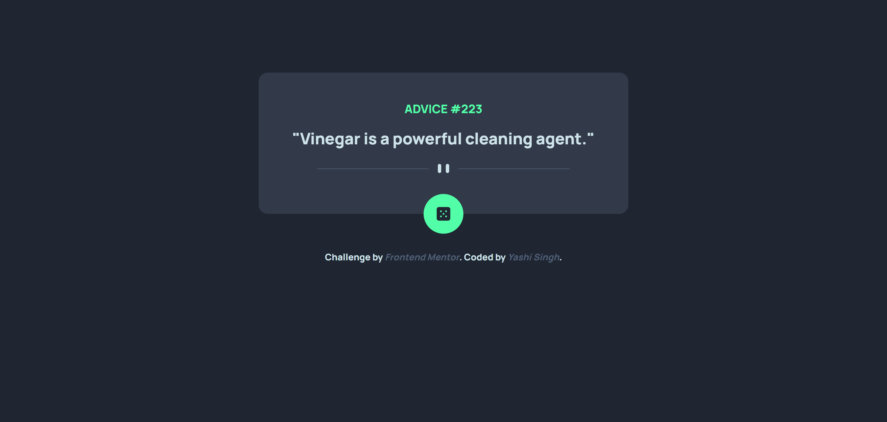
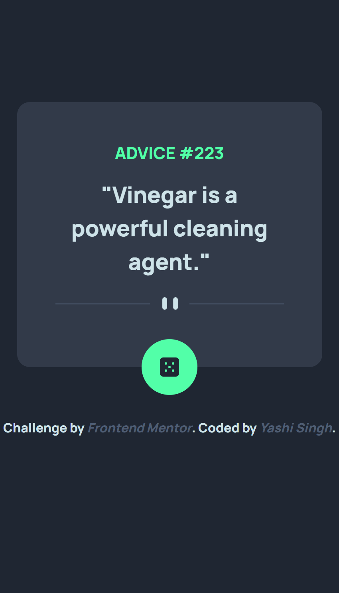

# Frontend Mentor - Advice Generator App Solution

This is a solution to the [Advice Generator App challenge on Frontend Mentor](https://www.frontendmentor.io/challenges/advice-generator-app-QdUG-13db). Frontend Mentor challenges help improve coding skills by building real-world projects.

## Table of Contents

- [Overview](#overview)
  - [The Challenge](#the-challenge)
  - [Screenshots](#screenshots)
  - [Live Demo](#live-demo)
- [Built With](#built-with)
- [Features](#features)
- [Installation & Setup](#installation--setup)
- [What I Learned](#what-i-learned)
- [Future Improvements](#future-improvements)
- [Resources](#resources)
- [Author](#author)
- [Acknowledgments](#acknowledgments)

## Overview

### The Challenge

Users should be able to:

- View an optimal layout for the app depending on their device's screen size
- See hover states for interactive elements
- Generate a new piece of advice by clicking the dice icon

### Screenshots

#### **Desktop View**



#### **Mobile View**



### Live Demo

- [Solution on Frontend Mentor](https://www.frontendmentor.io/solutions/advice-generator-app-SU1t6L0Bqn)
- [Live Demo](https://yashi-singh-9.github.io/Advice-Generator-App/)

## Built With

- **Semantic HTML5**
- **CSS with Less (CSS Preprocessor)**
- **JavaScript (Fetch API for async data fetching)**
- **Bootstrap 5**
- **Mobile-First Approach**

## Features

- Fetches random advice from an API
- Responsive design for desktop and mobile
- Smooth UI interactions with hover effects

## Installation & Setup

To run this project locally:

1. **Clone the Repository:**
   ```sh
   git clone https://github.com/Yashi-Singh-9/Advice-Generator-App.git
   cd Advice-Generator-App
   ```

2. **Install Less (if not installed):**
   ```sh
   npm install -g less
   ```

3. **Compile Less to CSS:**
   ```sh
   lessc styles.less styles.css
   ```

4. **Open `index.html` in a browser.**

## What I Learned

This project helped reinforce my understanding of:

- Asynchronous JavaScript using the `fetch()` API
- Dynamic content updates with JavaScript
- Responsive design using Bootstrap and Less

### Example Code (Fetching Advice)

```js
async function fetchAdvice() {
    try {
        const response = await fetch('https://api.adviceslip.com/advice');
        const data = await response.json();
        document.getElementById('advice-id').textContent = data.slip.id;
        document.getElementById('advice-text').textContent = `"${data.slip.advice}"`;
    } catch (error) {
        document.getElementById('advice-text').textContent = "Failed to load advice. Try again!";
    }
}

window.onload = fetchAdvice;
```

## Future Improvements

- Enhance UI animations for smoother interactions
- Implement caching to reduce API calls
- Improve error handling and user feedback mechanisms

## Resources

- [Bootstrap 5 Documentation](https://getbootstrap.com/docs/5.3/) - For responsive design and UI components.
- [Advice Slip API](https://api.adviceslip.com/) - Used to fetch random advice.

## Author

- Frontend Mentor - [Yashi-Singh-9](https://www.frontendmentor.io/profile/Yashi-Singh-9)
- LinkedIn - [Yashi Singh](https://www.linkedin.com/in/yashi-singh-b4143a246)

## Acknowledgments

Thanks to the Frontend Mentor community for great challenges that improve coding skills. Looking forward to building more projects!
